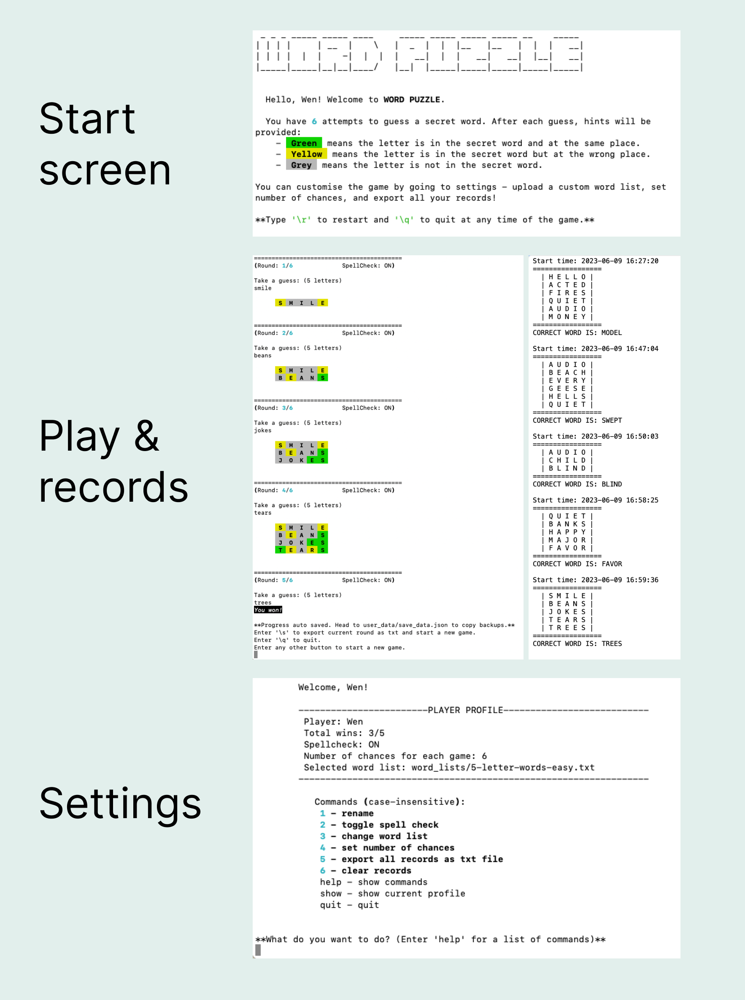

# Word Puzzle

Word Puzzle is a Wordle-like word game app with various customisable and extended features. Try your best to guess the word - you will be able to enjoy this game offline anytime, to your liking, with all the records safely stored in a save file.


### System Requirements

The program should be able to run on cross platforms including Windows, Linux and MacOs. Note that the program is developed in MacOs environment.

Python 3.10 or higher is needed to run the program.

The following dependencies are required:

```
iniconfig==2.0.0
markdown-it-py==2.2.0
mdurl==0.1.2
packaging==23.1
pluggy==1.0.0
Pygments==2.15.1
pyspellchecker==0.7.2
pytest==7.3.1
rich==13.3.5
```

You might not need to download them manually - follow the steps in the installation guide below to find out.

### Installation and execution

#### Option 1: using bash script

1. Open terminal. Use `cd` command and direct to the `src` directory.
2. Enter `chmod +x word_puzzle.sh`
3. Enter `./word_puzzle.sh play` to start the game; enter `./word_puzzle.sh settings` to access the player settings.

   > If you do not have python installed or the version is older than "3.10", please follow the prompt in the termianl and install the newer version of Python.

#### Option 2: Manual set up

1. Open terminal. Enter `python3 --version` to confirm the numer is higher than "3.10". If not, please download a newer version of Python first.
2. Use `cd` command and direct to the `WenxuanPan_T1A3/src` directory.
3. Enter `python3 -m venv .venv` to create a virtual environment.
4. Enter `source .venv/bin/activate` to activate venv.
5. Enter `python3 -m pip install -r requirements.txt` to install all the required dependencies. (This step can be skipped if you're relaunching and have already installed all the packages)
6. Enter `python3 main.py play` to play game; enter `python3 main.py settings` to view and change user settings.

## Features



Word Puzzle consists of the following features:

### Draw a random word from a given word list

- The program will read the txt file in the given directory and generate a word list; it will then select a random word for user to guess.
- Error handling is integrated to deal with cases when the text file is empty or contains no word more than 2 characters.
- The random word is stored in a variable to allow for further uses.

### Takes user input and check if it follows game's rule

- The program reveals the number of letters for the word and asks the user to take a guess. It then compares the guessed with the answer.
- It validates that the guess is an English word and/or contains alphabetic letters only. Loops and conditional structures are utilised to repeatedly ask for user input until a valid response is received.

#### Allow user to restart and quit the game at any time

- This can be considered as the sub-feature for taking user input. Conditionals and error handling is utlisied, so that when the user types special commands, exception (including a custom exception class) will be raised and then catched outside the loop to restart/quit the game gracefully.

### Compare user's guess with answer and display differences

- The program checks the guess to see if it matches the answer. Two functions are used - one is to check if the guess equals to answer, and is used as a condition in the if/else statement. The other function is to analyse and display which letters are correct (in the answer word and in the same place), misplaced or wrong (not in the word).
- External package Rich is used to highlight letters in different colours.

### Display progress information throughout the gameplay

- The user has a certain number of attempts to guess the word. Loops are used to repeatedly get input until the user runs out of chances. Guessing the correct word early will also break the loop.
- During each round, relevant information will be displayed including the user's previous guesses, number of chances used and total chances, spell check status (whether the program will check if the user's guess is an English word), as well as some narrative text.

### Show ending message based on result

- The game will display different ending message when user fails/succeeds in guessing the word.
- Random package is used so that the message text will not be the same everytime.

### Export records as text file

- The user will be able to export formatted records as txt files and the program will display the exported file path.
- They have the option to export records of one round each time game ends, where the save file will be named after the start time of the session; or they can go to settings and export all the records into one file, with file name being their profile name.

### Customise player profile and settings

- The player can access settings and have a number of customise options, including renaming, selecting the word list, toggling spell check status, setting the number of chances, exporting records as txt file and clearing all records. The player profile will also be displayed each time they open settings.
- Player class is created to encapsulate all the relevant information of the user. When instance of the class is created, methods such as getters and setters are imported and can be used in both main play and settings mode.
- bash scripts are used to pass on arguments to the python file, and with the help of conditional structures, the player can easily switch between 'play' and 'settings' mode.

### Save and load data using json

- Player's information will be exported to a json file and imported back to the object when the program reopens.
- Error handling is utlitised to deal with missing or corrupted files - when it catches relevant exceptions, default information will be set to allow the program to continue.

## References

- [Wordle - New York Times](https://www.nytimes.com/games/wordle/index.html): This project takes inspiration and extends from the popular word game Wordle.
- [rich - Pypi](https://pypi.org/project/rich/) - I used this python library to render colored and styled text.
- [pyspellchecker - Pypi](https://pypi.org/project/pyspellchecker/) - I used this python library to check spelling of user input.
- I referred to the following text files to generate word lists:
  - [The Stanford GraphBase: A Platform for Combinatorial Computing](https://www-cs-faculty.stanford.edu/~knuth/sgb.html): I used this to generate the two lists with 5-letter words.
  - [common-7-letter-words - Github](https://github.com/powerlanguage/word-lists/blob/master/common-7-letter-words.txt)
  - [google-profanity-words - Github](https://github.com/coffee-and-fun/google-profanity-words): I used this list to filter out inappropriate words in the 5-letter-word lists
- [A Python Wordle Clone - Practice Python](https://www.practicepython.org/blog/2022/02/12/wordle.html): I referred to the codes in this webpage to develop my function to compare two words
- [Text to ASCII Art Generator - patorjk](http://patorjk.com/software/taag/): I used this link to generate the ascii art for my title
